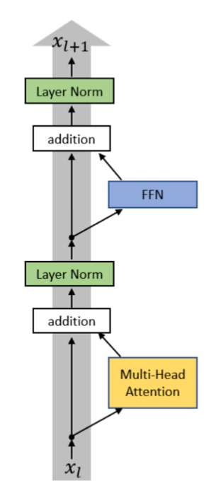
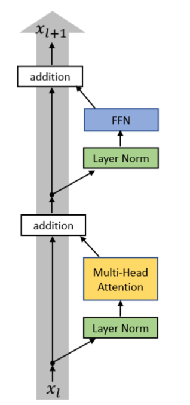
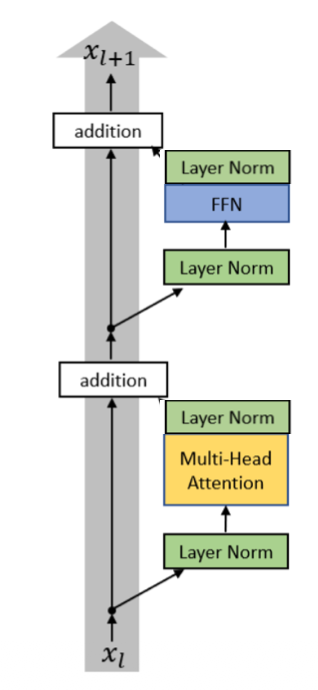

# CS336 Lecture 03 --- LLM Architecture & Training

## Goal of the Lecture

Understand **how modern large language models are architected and
trained**, and what design choices most real models share.

The lecture analyzes **many recent LLM papers** to determine:

-   What architecture components are common
-   Which parts vary across models
-   What hyperparameters matter most
-   What tricks make training stable

------------------------------------------------------------------------

## Baseline: Original Transformer

Original Transformer architecture contained:

Components: 
- Token embedding 
- Positional encoding (sin/cos) 
- Multi‑Head Self Attention 
- Feed Forward Network (FFN) 
- Residual Connections 
- LayerNorm 
- Final linear + softmax

Key design choices:

  Component          | Original Choice
  ------------------- |------------------------
  Position encoding  | Sinusoidal
  Activation         |ReLU
  Normalization       |Post‑LayerNorm
  FFN                 |Linear → ReLU → Linear

------------------------------------------------------------------------

## Modern Transformer Variant (Typical LLM)

Most modern LLMs use a slightly different architecture.

Common differences:

  Component          | Modern Choice
  -------------------| ---------------------------------------
  Normalization      | **Pre‑Norm with RMSNorm**
  Position encoding   |**RoPE (Rotary Position Embeddings)**
  Activation          |**SwiGLU / GeGLU**
  Bias terms          |Usually removed

Motivation: 
- Better training stability 
- Faster training 
- Fewer parameters

------------------------------------------------------------------------

### Pre‑Norm vs Post‑Norm

Normalization can be placed **before or after** the residual block.

#### Post‑Norm (original transformer)

#### Pre‑Norm (modern LLMs)

#### Why Pre‑Norm Wins

Empirical findings:

-   Better **gradient flow**
-   Prevents **gradient spikes**
-   Enables **larger learning rates**
-   More stable for **very deep networks**

Almost all modern LLMs use **pre‑norm**.

#### Double Norm

Putting 2 Norm layer double team the FFN/Att

------------------------------------------------------------------------

### RMSNorm vs LayerNorm

#### LayerNorm

Normalizes using:

-   mean
-   variance

Formula:

$$ y = \frac{x − mean(x)}{\sqrt{var(x) + ε}} * γ + β $$

#### RMSNorm

Simpler normalization:

$$ y = \frac{x}{\sqrt{mean(x²) + ε}} * γ $$

Differences:

  Feature          |LayerNorm  | RMSNorm
  ---------------- |----------- |---------
  subtract mean    |yes         |no
  bias parameter   |yes         |no
  compute cost     |higher      |lower

#### Why RMSNorm -> Simplification 

Advantages:

-   fewer parameters (**no bias** term to store)
-   fewer operations (**no mean** calculation)
-   faster runtime (**similar performance**)

Even though matrix multiplies dominate FLOPs so you might thinking these improvement is nothing, but normalization still matters due to **memory movement costs** because Normalization take 25 % of runtime.

------------------------------------------------------------------------

### Dropping Bias Terms

Most modern transformers remove bias parameters from:

-   Linear layers
-   LayerNorm

Reasons:

1.  Slight memory savings
2.  Slight compute savings
3.  Empirically little performance loss
4.  Improve stability

------------------------------------------------------------------------

### Activation Functions

Many activation functions exist:

Examples:

-   ReLU
-   GeLU
-   Swish
-   GLU variants

#### Feed Forward Layer

Standard form:

    FF(x) = activation(xW1)W2

------------------------------------------------------------------------

#### Gated Activations (GLU)

GLU variants introduce **gating**.

Example: ReGLU

    FF(x) = (ReLU(xW1) ⊙ (xV))W2

where:

⊙ = element‑wise multiplication

Popular variants:

  Activation   Used by
  ------------ ------------------
  GeGLU        T5
  SwiGLU       LLaMA
  ReGLU        some experiments

##### Key Insight

Gated activations consistently improve performance slightly.

Therefore **SwiGLU** became common.

------------------------------------------------------------------------

### Serial vs Parallel Transformer Blocks

Standard transformer blocks compute:

    Attention → MLP

This is **serial**.

Some models compute both in parallel:

    output = x + Attention(LN(x)) + MLP(LN(x))

Advantages:

-   faster training
-   better kernel fusion
-   shared LayerNorm

Used in:

-   GPT‑J
-   PaLM
-   GPT‑NeoX

------------------------------------------------------------------------

# Position Embeddings

Transformers need positional information.

Common approaches:

  Type                 |Idea
  -------------------- |----------------------------------------
  Sinusoidal           |add sin/cos encoding
  Absolute embedding   |add learn position vector
  Relative embedding   |attention depends on relative distance
  RoPE                 |rotate vectors by position

------------------------------------------------------------------------

# RoPE (Rotary Position Embedding)

RoPE rotates query/key vectors depending on position.

Core idea:

The **inner product between rotated vectors encodes relative position**.

Properties:

-   preserves vector magnitude
-   allows attention to depend on **relative distance**
-   works well for long contexts

Implementation:

1.  split embedding dimensions into pairs
2.  rotate each pair using sin/cos
3.  apply rotation to **query and key** vectors

Most modern LLMs use RoPE.

------------------------------------------------------------------------

# Hyperparameters in Transformers

Important hyperparameters include:

-   model dimension
-   feedforward dimension
-   number of attention heads
-   vocabulary size

------------------------------------------------------------------------

# Feedforward Dimension Rule

Common rule:

    d_ff = 4 × d_model

Example:

    d_model = 4096
    d_ff = 16384

### GLU Exception

GLU layers reduce dimension by 2/3.

Typical ratio:

    d_ff ≈ 8/3 × d_model

Many modern models follow this.

------------------------------------------------------------------------

# Attention Head Dimensions

Typical relationship:

    head_dim × num_heads ≈ d_model

Example (GPT‑3):

    num_heads = 96
    head_dim = 128
    d_model = 12288

Ratio ≈ 1.

This is not theoretically required but works well empirically.

------------------------------------------------------------------------

# Model Aspect Ratio

Models vary in **depth vs width**.

Typical ratio:

    d_model / n_layers ≈ 100–200

Example:

  Model   Ratio
  ------- -------
  LLaMA   \~102
  GPT‑3   \~128
  PaLM    \~156

Very deep models are harder to parallelize and slower.

------------------------------------------------------------------------

# Vocabulary Size

Typical vocab sizes:

  Model Type            Vocab Size
  --------------------- ------------
  Monolingual models    30k--50k
  Multilingual models   100k--250k

Examples:

  Model   Vocab
  ------- -------
  GPT‑2   50k
  LLaMA   32k
  PaLM    256k

Large vocabularies are needed for multilingual tasks.

------------------------------------------------------------------------

# Regularization

Classic techniques:

-   dropout
-   weight decay

Observation:

Modern LLMs often **disable dropout** during pretraining.

Instead they rely on:

-   large datasets
-   weight decay

Weight decay mostly helps **optimization stability** rather than
overfitting.

------------------------------------------------------------------------

# Training Stability Tricks

Training very large models can become unstable.

Common tricks:

### 1. Z‑Loss

A regularization term added to the output softmax.

Purpose:

-   prevent logits from becoming extremely large
-   stabilize training

Used in:

-   PaLM
-   OLMo
-   Baichuan

------------------------------------------------------------------------

### 2. QK Normalization

Normalize **queries and keys** before computing attention softmax.

Purpose:

-   prevent large dot products
-   stabilize attention distribution

------------------------------------------------------------------------

### 3. Logit Soft‑Capping

Apply:

    tanh(logits)

This caps extremely large logits.

------------------------------------------------------------------------

# Efficient Attention Variants

Standard attention cost:

    O(n²)

where:

n = sequence length

Several tricks reduce cost.

------------------------------------------------------------------------

# Multi‑Query Attention (MQA)

Idea:

Use many queries but **only one key/value head**.

Benefits:

-   smaller KV cache
-   faster inference
-   less memory usage

Tradeoff:

-   slightly worse perplexity.

------------------------------------------------------------------------

# Grouped Query Attention (GQA)

Middle ground between:

-   full multi‑head attention
-   MQA

Queries are split into groups that share keys/values.

Benefits:

-   better quality than MQA
-   still reduces inference cost

Used in many modern LLMs.

------------------------------------------------------------------------

# Sparse / Sliding Window Attention

Instead of attending to **all tokens**, restrict attention to:

-   nearby tokens
-   structured patterns

Benefits:

-   reduces quadratic cost
-   supports long contexts

Example: **Mistral sliding‑window attention**.

------------------------------------------------------------------------

# Key Takeaways

Across modern LLMs there is significant convergence:

### Architecture

Common pattern:

-   Pre‑Norm
-   RMSNorm
-   RoPE
-   SwiGLU

### Hyperparameters

Typical values:

-   d_ff ≈ 4 × d_model
-   head_dim × heads ≈ d_model
-   vocab ≈ 30k--50k

### Efficiency Tricks

-   MQA / GQA
-   sparse attention
-   KV cache optimization

### Stability Tricks

-   z‑loss
-   QK normalization
-   logit soft‑capping

Overall insight:

Most modern LLMs are **very similar architectures with small
improvements** rather than radically different designs.
